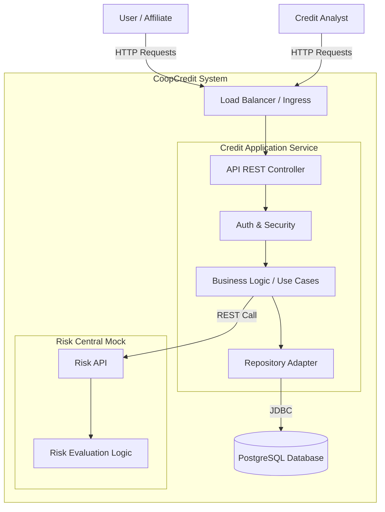
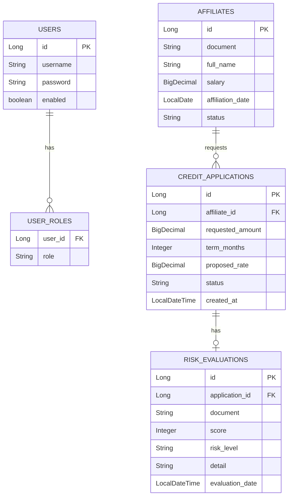
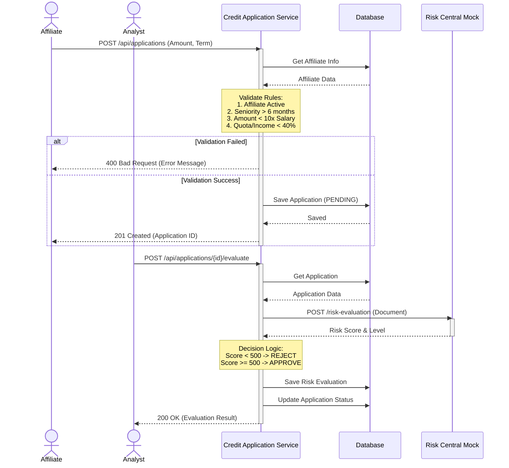
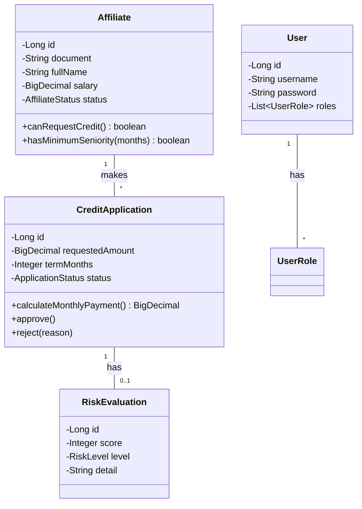

# 📊 Project Diagrams

## 1. System Architecture

This diagram shows the high-level architecture of the CoopCredit system, including the microservices, database, and external interactions.

## 2. Database Entity-Relationship Diagram (ERD)

This diagram illustrates the data model and relationships between entities in the PostgreSQL database.

## 3. Credit Application Flow (Sequence Diagram)

This sequence diagram details the process of creating and evaluating a credit application.

## 4. Class Diagram (Domain Model)

This diagram represents the core domain entities and their relationships within the Hexagonal Architecture.

